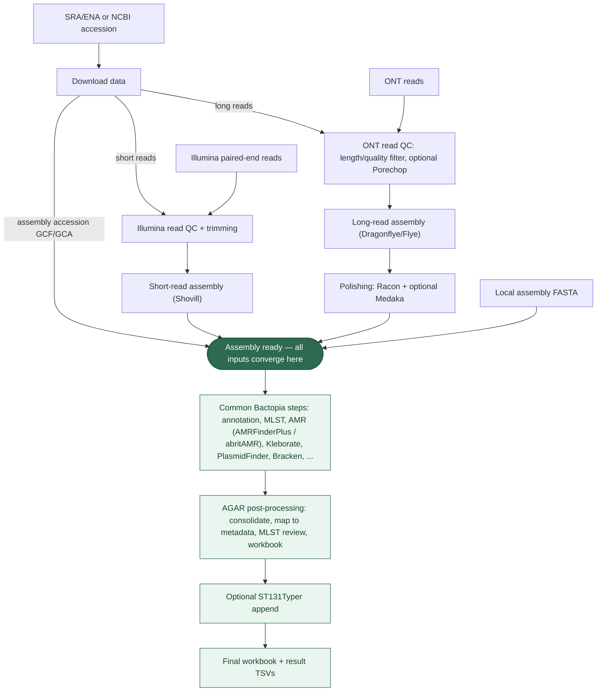

# agar-bactopia-pipeline

`agar-bactopia-pipeline` is an AGAR-compatible packaging of Bactopia for HPC
use. It wraps submission, batching, result consolidation, metadata mapping,
MLST review, workbook export, and optional ST131Typer follow-up into one
workflow.

This page covers **how to use** the pipeline (the command, inputs, and outputs).
For **setting up** an environment, pick the matching setup guide below.

## Table Of Contents

- [Motivation](#motivation)
- [Pipeline Overview](#pipeline-overview)
- [Installation](#installation)
- [Submission Modes](#submission-modes)
- [Running The Pipeline](#running-the-pipeline)
- [Metadata Sheet](#metadata-sheet)
- [Input Manifests (FOFN)](#input-manifests-fofn)
- [Common Variations](#common-variations)
- [Optional Tools: FimTyper And ST131Typer](#optional-tools-fimtyper-and-st131typer)
- [Outputs](#outputs)
- [Troubleshooting](#troubleshooting)
- [Repository Layout](#repository-layout)
- [Documentation](#documentation)

## Motivation

For a normal run, the pipeline:

1. accepts paired-end Illumina reads, ONT reads, local assemblies, or accessions
2. creates or reuses the mode-specific Bactopia input manifest
3. splits the run into manageable batches
4. submits Bactopia jobs
5. consolidates the batch outputs
6. maps the results back to the metadata sheet
7. runs MLST review for flagged samples
8. exports a final workbook

Compared with plain Bactopia, this repo also includes AGAR-facing workflow
behaviour such as metadata mapping, MLST review logic, optional FimTyper
integration, and optional ST131Typer append workflows.

An existing Bactopia installation (**v3.2.0**) is a prerequisite; Bactopia is
not bundled by this repository, and Bactopia v4 should not be substituted
without retesting. See [docs/bactopia-setup.md](docs/bactopia-setup.md) for
installing Bactopia, downloading the custom datasets, and how Kleborate is
provided.

## Pipeline Overview

The input type only changes the **front** of the pipeline (how you get to an
assembly). Once an assembly exists, every input follows the **same** downstream
steps. Key differences:

- **Illumina** — read QC/trimming, then short-read assembly.
- **ONT** — ONT read QC (length/quality filter, optional Porechop adapter
  removal), long-read assembly, then a **polishing** step (Racon + optional
  Medaka) that no other input has.
- **SRA/ENA or NCBI accession** — download first, then behave like reads
  (Illumina/ONT) or, for an assembly accession (GCF/GCA), like a local assembly.
- **Local assembly** — skips read QC, assembly, and polishing entirely.



Everything from **Assembly ready** downward is identical across input types; only
the coloured shared lane and the ONT-only polishing box differ by input.

## Installation

`agar-bactopia-pipeline` is a **clone-and-run** repository — there is no build
step and no `pip`/`conda` package to install. You clone it, then follow the setup
guide for your environment ([Submission Modes](#submission-modes)) to install the
external dependencies and write your site config.

### 1. Get the code

```bash
git clone https://github.com/sethiyap/agar-bactopia-pipeline.git
cd agar-bactopia-pipeline
./bin/agar-bactopia            # prints usage; this is the entry point
```

`bin/agar-bactopia` is the only entry point — run it in place, or add the repo's
`bin/` to your `PATH`. On the shared rg42 Gadi install it already lives at
`/g/data/rg42/agar-bactopia-pipeline` (nothing to clone — see
[docs/setup-gadi-rg42.md](docs/setup-gadi-rg42.md)).

### 2. External dependencies (installed once per environment)

The repo ships only the orchestration scripts. These must exist on the host and
are pointed to from your site config:

- **Bactopia v3.2.0** (`BACTOPIA_PIPELINE`) + its **custom datasets** (`DATASETS_CACHE`)
  and **Kleborate** — see [docs/bactopia-setup.md](docs/bactopia-setup.md)
- **Nextflow**, a container engine (**Singularity**/**Apptainer**, or Docker), and **R**
- **conda/mamba** with **`mlst`** + **`seqkit`** for MLST review, and **`python3`** +
  **`openpyxl`** for the workbook
- **Optional: ST131Typer** (`ST131_TYPER_DIR`) — not bundled; only needed if you
  enable `RUN_ST131_TYPER=1`. Also needs `mlst`/`seqkit` on `PATH`.

One helper covers the last two on non-Gadi hosts — it installs Miniforge, an
`mlst`+`seqkit` conda env, and clones ST131Typer (symlinking `ST131Typer.sh`):

```bash
./scripts/install_optional_local_tools.sh
```

It does **not** install Bactopia, the datasets, Nextflow, the container engine, or
`openpyxl` — provide those separately. Full bundled-vs-external list:
[docs/runtime-dependencies.md](docs/runtime-dependencies.md).

#### Tool container images

Bactopia runs each tool inside a container, so the **tool images must be
downloaded** before (or during) the first run. Nextflow pulls them
**automatically** into `SING_CACHE` on first use and reuses them afterwards — so
the first run needs internet access. The images come from public registries
(BioContainers, mirrored as ready-to-use Singularity images at the Galaxy Depot):

- <https://depot.galaxyproject.org/singularity/> — Bactopia's per-tool images
- pinned examples: `quay.io/biocontainers/mlst:2.33.1--hdfd78af_0`,
  `quay.io/biocontainers/kleborate:2.3.2--pyhdfd78af_0`

To pre-stage them (offline hosts, or to avoid the first-run pull), use the helper —
it downloads `mlst`/`kleborate` into `SING_CACHE` and prints the `*_CONTAINER`
lines to add to your site config:

```bash
./scripts/pull_local_containers.sh            # add --with-fimtyper to also fetch FimTyper
```

**FimTyper** has no public image (the GHCR one is private), so either build a
`.sif` and set `FIMTYPER_CONTAINER`, or run it natively via `FIMTYPER_DIR` /
`FIMTYPER_ENV` — see [FimTyper](#fimtyper).

### 3. Create your site config

Copy the example for your backend and edit the paths (skip on the pre-configured
rg42 install):

```bash
cp config/sites/gadi.env.example  config/sites/gadi.local.env    # PBS / Gadi
cp config/sites/slurm.env.example config/sites/slurm.local.env   # Slurm
cp config/sites/local.env.example config/sites/local.local.env   # local (no scheduler)
```

Then validate everything before a real run with `--dry-run` (see
[Running The Pipeline](#running-the-pipeline)). Environment-specific steps are in
the setup guides below.

## Submission Modes

The same workflow runs through one of **three submission backends** — the word
after `submit` on the command line. Pick the one that matches your system, then
follow its setup guide. All three end in the same universal command
([Running The Pipeline](#running-the-pipeline)).

### 1. PBS submission (NCI Gadi) — `submit gadi`

For the PBS Pro scheduler on **NCI Gadi**. Jobs are submitted with `qsub`. This
covers both Gadi deployments:

- **Shared `rg42` install** — already installed and configured; you just move
  data in, submit, and copy results back →
  [docs/setup-gadi-rg42.md](docs/setup-gadi-rg42.md)
- **Another Gadi project (non-rg42)** — deploy under your own NCI project:
  install Bactopia + datasets and write your site config →
  [docs/setup-gadi-other.md](docs/setup-gadi-other.md)

### 2. Slurm submission — `submit slurm`

For a **non-Gadi Linux cluster with a working Slurm scheduler**. Jobs are
submitted with `sbatch`. Set your partition/account and paths in a Slurm site
config → [docs/setup-non-gadi.md](docs/setup-non-gadi.md)

### 3. Local submission (Linux host or Firefly) — `submit local`

For a **single Linux host with no working scheduler** — either there is no
PBS/Slurm at all, or the scheduler is down (as on Firefly, where Slurm is
unavailable). Every stage runs on the machine **in order, with no `qsub`/`sbatch`**,
and Bactopia's own processes run with Nextflow's local executor — nothing is ever
submitted. Because it runs in the foreground, start it inside `tmux`/`screen` on a
remote host so it survives disconnects. Simpler and slower; ideal for trial runs
and small batches. Core Bactopia, Kleborate, MLST review, and workbook export run
by default; **ST131Typer** works too, and **FimTyper** is off by default but can be
enabled →
[docs/setup-non-gadi.md → local backend](docs/setup-non-gadi.md#no-scheduler-use-the-local-backend)

## Running The Pipeline

Command shape (the backend is `gadi` for PBS, `slurm` for Slurm, or `local` for
a single host with no scheduler — see
[docs/setup-non-gadi.md](docs/setup-non-gadi.md#no-scheduler-use-the-local-backend)):

```bash
./bin/agar-bactopia submit gadi \
  [OPTIONS] INPUT_SOURCE METADATA_DIR RESULTS_ROOT [BATCH_SIZE]
```

A minimal run with placeholder paths:

```bash
./bin/agar-bactopia submit gadi \
  /path/to/raw_fastqs \
  /path/to/metadata \
  /path/to/results \
  50
```

Main public options:

- `--input-type illumina|ont|assembly|accession`: select the input contract; default `illumina`
- `--medaka-rounds N`: enable Medaka polishing for native Bactopia ONT runs
- `--medaka-model MODEL`: use the model matching the ONT basecaller model
- `--ont-minlength N`: set Bactopia's minimum ONT read length
- `--ont-minqual N`: set Bactopia's minimum average ONT read quality
- `--use-porechop yes|no`: control ONT adapter removal in Bactopia
- `--genome-size N`: expected genome size in bp (default `5000000`). Drives
  Bactopia's coverage QC gate **and** read subsampling — see
  [Genome Size And QC Gates](#genome-size-and-qc-gates)
- `--exclude-samples REGEX`: skip samples whose name matches `REGEX`
  (case-insensitive) so they are never batched or assembled — e.g.
  `'unclassified|lambda|neg'` to drop ONT controls. Excluded samples are logged;
  the original manifest is preserved and a `*.filtered.fofn` is used for the run
- `--additional-tools yes|no`: turn the extra tool bundle on or off
- `--dry-run`: validate config, inputs, and dependencies without submitting jobs
- `--is-agar-project auto|1|0`: control AGAR-specific normalization and filtering
- `--site-config /path/to/site.local.env`: use a different site config file
- `--mail-user you@example.org`: override `PBS_MAIL_USER` for one submission
- `--mail-options ae`: override `PBS_MAIL_OPTIONS` for one submission

Arguments:

- `INPUT_SOURCE`: an input directory for Illumina, ONT, or assemblies; a text file for accessions
- `METADATA_DIR`: folder containing the required `*_samplesheet.txt` and optional Bactopia manifests
- `RESULTS_ROOT`: where batch outputs, consolidated outputs, mapped TSVs, and workbook are written
- `BATCH_SIZE`: optional; if omitted, the config default is used, otherwise `50`

The default batch family prefix is `batch_bactopia`, so outputs usually appear
under names such as `batch_bactopia_001`, `batch_bactopia_001_tools`, and
`batch_bactopia_consolidated`.

> Always `--dry-run` first — it validates the config, metadata, FOFN handling,
> and key dependencies (including that `DATASETS_CACHE` exists) before any jobs
> are queued.

## Metadata Sheet

Your metadata directory must contain exactly one `*_samplesheet.txt` unless you
set `AGRF_SHEET_PATH` explicitly. This metadata sheet is mandatory for every
input type: Illumina, ONT, local assembly, SRA/ENA accession, and NCBI assembly
accession.

The sheet needs two columns:

- **column 1** — the sample identifier, used to join metadata back onto results
- **column 2** — the organism/phenotype note used by downstream MLST review logic

A minimal tab-delimited `*_samplesheet.txt` looks like this:

```text
Sample name	Organism
24GNB-1676	Escherichia coli
24GNB-1737	Escherichia coli
24GNB-1738	Klebsiella oxytoca
24GNB-1739	Escherichia coli
24GNB-1740	Klebsiella pneumoniae
24GNB-1741	Klebsiella oxytoca
```

The sheet may be tab- or comma-delimited, and the sample name must match the
FOFN/accession sample exactly. See [docs/input-formats.md](docs/input-formats.md)
for the full rules and per-input-type FOFN examples.

How the columns are read:

- if headers `Sample name` **and** `Comments` are both present, they are used by name
- otherwise the pipeline falls back to position — first column as the sample
  name, second column as the organism/phenotype note (so a second column headed
  `Organism`, as above, is used correctly)

Important behaviour:

- every input sample must occur in the metadata `Sample name` column
- for accession input, `Sample name` must be the submitted accession
- for non-AGAR projects, sample names are used as they are
- for AGAR projects, the launcher can normalize AGAR-style FASTQ names before FOFN creation
- mapped output files reuse the metadata sheet prefix — the part of the filename
  before `_samplesheet.txt`. For example, `B07_samplesheet.txt` gives the prefix
  `B07` and produces outputs such as `B07_samplesheet_with_results.tsv`.

## Input Manifests (FOFN)

Bactopia is driven by a tab-delimited file-of-filenames (FOFN). The launcher
usually **creates it for you** from `INPUT_SOURCE`, and reuses an existing one if
present. Each input type has its own manifest:

| Input type | Manifest file | `runtype` | Where the path goes |
| --- | --- | --- | --- |
| `illumina` | `samplesheet.fofn` | `paired-end` | `r1` + `r2` |
| `ont` | `samplesheet.ont.fofn` | `ont` | `r1` (r2/extra empty) |
| `assembly` | `samplesheet.assembly.fofn` | `assembly` | `extra` (r1/r2 empty) |
| `accession` | *(none — plain text list)* | n/a | one accession per line |

All FOFN files share the header `sample	runtype	r1	r2	extra` and keep
empty cells as empty tab fields. Because ONT and assembly use distinct filenames
(`samplesheet.ont.fofn` / `samplesheet.assembly.fofn`), they cannot silently
reuse an Illumina FOFN.

Reuse and naming notes:

- if `samplesheet.fofn` already exists in `METADATA_DIR`, the launcher reuses it;
  after changing the raw FASTQ folder, delete or move aside the old one so the
  batch list is rebuilt
- if the launcher creates `samplesheet.fofn`, the sample name comes from the
  FASTQ basename before the first underscore in `*_R1.fastq.gz`
- if you provide your own `samplesheet.fofn`, its `sample` values are used as-is
- in every case, metadata sample names must match the final FOFN sample names

See [docs/input-formats.md](docs/input-formats.md) for the full per-type FOFN
format, examples, and validation.

## Common Variations

These are the most common changes to the standard submission command. Examples
use placeholder paths; substitute your own (rg42 users: see
[docs/setup-gadi-rg42.md](docs/setup-gadi-rg42.md)).

### Submit ONT Reads

Place **one concatenated, compressed ONT FASTQ per sample** in the input
directory. The filename without `.fastq.gz` or `.fq.gz` becomes the sample name
and must match `Sample name` in the required `*_samplesheet.txt`. The wrapper
creates `samplesheet.ont.fofn` automatically.

To avoid wasting compute on controls (the ONT `unclassified` barcode bin, Lambda
spike-ins, negative controls), drop them with `--exclude-samples`:

```bash
./bin/agar-bactopia submit local --input-type ont \
  --exclude-samples 'unclassified|lambda|neg' \
  /path/to/ont_fastqs /path/to/metadata /path/to/results_ont 25
```

Matching is case-insensitive; excluded samples are logged and never assembled.

If a sample's reads are split across several FASTQ chunks (e.g. per-barcode
run folders), **concatenate them into one file yourself before submission** —
the pipeline does not merge them, and each leftover file would otherwise be
treated as a separate sample:

```bash
cat ONT01_part1.fastq.gz ONT01_part2.fastq.gz > ONT01.fastq.gz
```

```bash
./bin/agar-bactopia submit gadi \
  --input-type ont \
  --ont-minlength 1000 \
  --ont-minqual 10 \
  /path/to/ont_fastqs \
  /path/to/metadata \
  /path/to/results_ont \
  20
```

Bactopia performs ONT read QC before Dragonflye/Flye assembly. Medaka is not
enabled by default. To enable one Medaka round, also provide the basecaller
model:

```bash
./bin/agar-bactopia submit gadi \
  --input-type ont \
  --medaka-rounds 1 \
  --medaka-model '<basecaller-model>' \
  /path/to/ont_fastqs \
  /path/to/metadata \
  /path/to/results_ont \
  20
```

Bactopia is the only path with a read-polishing step; see the
[Pipeline Overview](#pipeline-overview) flowchart for where Medaka/Racon fit.

Multiplexed ONT runs frequently have some samples below Bactopia's coverage gate
(`10 × genome_size`); those are discontinued before assembly with a message like
`... does not exceed the required minimum 50000000 bp (10x coverage)`. To assemble
the shallow ones anyway (as provisional) and keep them flagged in the results,
relax the gates:

```bash
EXTRA_ARGS_STRING="--coverage 0 --min_coverage 0 --min_basepairs 0 --min_reads 0" \
GENOME_SIZE=5000000 ./bin/agar-bactopia submit local \
  --input-type ont \
  /path/to/ont_fastqs \
  /path/to/metadata \
  /path/to/results_ont \
  25
```

See [Genome Size And QC Gates](#genome-size-and-qc-gates) for what each flag does
and the `coverage_x` / `low_coverage` columns this adds to the results sheet.

### Genome Size And QC Gates

Bactopia uses the expected genome size for two things: its **coverage QC gate**
(Bactopia's `--min_coverage`, default `10`, so a sample needs at least
`10 × genome_size` basepairs) and its **read subsampling** target (`rasusa` trims
to `coverage × genome_size`). Set it with `--genome-size N` (or `GENOME_SIZE=N`);
the default is `5000000` (5 Mb).

Both `--genome-size` and the gate-relaxing `EXTRA_ARGS_STRING` below are optional
overrides — they do not change the base command. Deeply-covered isolates (typical
Illumina) clear the 10× gate easily and need neither; this mainly matters for
marginal-coverage data, usually multiplexed ONT.

- Use a realistic size (e.g. `6300000` for *P. aeruginosa*). It must be a
  positive integer — `0`/`1` do **not** disable QC, they shrink every sample to a
  few basepairs and then fail Bactopia's absolute floors, so they are rejected.
- Low-coverage samples legitimately fail QC and produce no assembly. To force
  them through anyway (provisional assemblies on shallow data), relax the gates
  with `EXTRA_ARGS_STRING`:

  ```bash
  EXTRA_ARGS_STRING="--coverage 0 --min_coverage 0 --min_basepairs 0 --min_reads 0" \
  GENOME_SIZE=5000000 ./bin/agar-bactopia submit local \
    --input-type ont /path/to/ont_fastqs /path/to/metadata /path/to/results 50
  ```

  Each flag disables one gate: `--min_coverage 0` the `genome_size × 10` coverage
  floor (the usual reason shallow samples are discontinued), `--coverage 0` the
  `rasusa` subsampling (so reads survive intact), and `--min_basepairs 0` /
  `--min_reads 0` the absolute read/basepair floors. Keep `GENOME_SIZE` realistic
  so the `coverage_x` flag stays meaningful.

Every sample's coverage (input basepairs ÷ genome size) is written to the results
sheet as `coverage_x`, with `low_coverage` = `yes` when it is below `10×`
(override the cutoff with `LOW_COVERAGE_THRESHOLD=N`). These are informational —
they flag shallow samples without excluding them. See [Outputs](#outputs).

### Submit Local Assemblies

The assembly directory may contain `.fasta.gz`, `.fna.gz`, or `.fa.gz` files.
The filename without the FASTA extension becomes the sample name; the wrapper
creates `samplesheet.assembly.fofn` automatically.

```bash
./bin/agar-bactopia submit gadi \
  --input-type assembly \
  /path/to/assemblies \
  /path/to/metadata \
  /path/to/results_assemblies \
  50
```

Bactopia receives these as assembly inputs. It does not run read QC, Flye,
Racon, or Medaka on them.

### Submit SRA/ENA Or NCBI Assembly Accessions

Create a plain, headerless text file with one accession per line (SRA/ENA read
accessions and NCBI assembly accessions can be mixed). Each accession must also
appear in the metadata `Sample name` column.

```bash
./bin/agar-bactopia submit gadi \
  --input-type accession \
  /path/to/accessions.txt \
  /path/to/metadata \
  /path/to/results_accessions \
  20
```

The launcher splits the list into batches and passes each batch to Bactopia with
`--accessions`. **Bactopia downloads each accession automatically** — SRA/ENA
run accessions are fetched as reads, and NCBI `GCF_`/`GCA_` accessions are
fetched as assemblies; there is no separate download step to run. Because the
download happens inside the batch job, **the compute node must have network
access** (on Gadi, normal compute nodes may not — check your queue/site before
submitting large accession runs). `--input-type accessions` is also accepted as
an alias.

### Validate The Installation Before Submitting

Use `--dry-run` to check the current config, metadata, FOFN handling, and key
dependencies without submitting any scheduler jobs.

```bash
./bin/agar-bactopia submit gadi \
  --dry-run \
  /path/to/raw_fastqs \
  /path/to/metadata \
  /path/to/results \
  50
```

### Tools: default vs additional

**Default tools** — always run (`RUN_TOOLS=1`, `DEFAULT_TOOLS_STRING`):

| Tool | Purpose |
|------|---------|
| `mlst` | Multi-locus sequence typing (scheme, ST, allele profile) |
| `amrfinderplus` | AMR genes + point mutations (NCBI) |
| `abritamr` | Curated AMRFinderPlus summary by drug class |
| `plasmidfinder` | Plasmid replicon typing |
| `bracken` | Species abundance (from Kraken2; needs `KRAKEN2_DB`) |
| `checkm` | Assembly completeness / contamination QC |

**Kleborate** runs by default too (`RUN_KLEBORATE=1`) but as its own stage —
*Klebsiella*-focused typing. **FimTyper** is opt-in (`RUN_FIMTYPER=0`) — *E. coli*
FimH typing (needs a container or native `FIMTYPER_DIR`/`FIMTYPER_ENV`).

**Additional tools** — opt-in bundle (`RUN_ADDITIONAL_TOOLS=0`,
`ADDITIONAL_TOOLS_STRING`), enabled with `--additional-tools yes`:

| Tool | Focus |
|------|-------|
| `ectyper` | *E. coli* O/H serotyping |
| `shigapass`, `shigatyper`, `shigeifinder` | *Shigella* / EIEC typing |
| `mobsuite` | Plasmid reconstruction / typing |
| `mashdist` | Mash distance (relatedness) |
| `mykrobe` | AMR / lineage (needs `MYKROBE_SPECIES`) |
| `defensefinder` | Anti-phage defense systems (optional `DEFENSEFINDER_DB`) |
| `ismapper` | Insertion-sequence mapping |
| `phispy` | Prophage detection |

Many additional tools are species-specific (e.g. `ectyper`, `shiga*`) and return
nothing outside their target organism. Customize either set per run without editing
defaults, e.g. `DEFAULT_TOOLS_STRING="mlst amrfinderplus abritamr plasmidfinder checkm"`.

```bash
./bin/agar-bactopia submit gadi \
  --additional-tools yes \
  /path/to/raw_fastqs \
  /path/to/metadata \
  /path/to/results \
  50
```

### Force Non-AGAR Mode

```bash
./bin/agar-bactopia submit gadi \
  --is-agar-project 0 \
  /path/to/raw_fastqs \
  /path/to/metadata \
  /path/to/results \
  50
```

### Use A Different Site Config

```bash
./bin/agar-bactopia submit gadi \
  --site-config /path/to/gadi.local.env \
  /path/to/raw_fastqs \
  /path/to/metadata \
  /path/to/results \
  50
```

### Override PBS Mail Settings

```bash
./bin/agar-bactopia submit gadi \
  --mail-user your.name@example.org \
  --mail-options ae \
  /path/to/raw_fastqs \
  /path/to/metadata \
  /path/to/results \
  50
```

### Run Non-Kleborate Tools In Parallel

```bash
RUN_TOOLS_PARALLEL=1 \
./bin/agar-bactopia submit gadi \
  /path/to/raw_fastqs \
  /path/to/metadata \
  /path/to/results \
  50
```

If `RUN_TOOLS_PARALLEL` is unset, the default is `0`.

### Test A Small Subset

Run only one named batch:

```bash
BATCH_IDS=005 BATCH_LIMIT=1 \
./bin/agar-bactopia submit gadi \
  /path/to/raw_fastqs \
  /path/to/metadata \
  /path/to/results \
  50
```

Start later in the batch list:

```bash
BATCH_START=3 BATCH_LIMIT=2 \
./bin/agar-bactopia submit gadi \
  /path/to/raw_fastqs \
  /path/to/metadata \
  /path/to/results \
  50
```

### Rerun Postprocessing Only

Use this when the batches already exist and you only want consolidation,
review, or workbook export again.

```bash
POSTPROCESS_ONLY=1 \
RUN_CONSOLIDATE=1 \
RUN_MLST_REVIEW=1 \
RUN_EXPORT_RESULTS_WORKBOOK=1 \
./bin/agar-bactopia submit gadi \
  /path/to/raw_fastqs \
  /path/to/metadata \
  /path/to/results \
  50
```

In `POSTPROCESS_ONLY=1` mode, the trailing `50` does not limit the work to 50
samples. Consolidation runs across all batch directories already present under
`RESULTS_ROOT`.

## Optional Tools: FimTyper And ST131Typer

**FimTyper** and **ST131Typer** are both **off by default on every backend**
(`gadi`, `slurm`, `local`) — they are opt-in per run because each needs setup the
core tools don't. Everything else (Bactopia, Kleborate, extra tools, MLST review,
mapping, workbook) runs automatically.

### FimTyper

Off by default, but **no external install needed**: the FimTyper image is
published to GHCR and **auto-pulled** by Nextflow (like mlst/kleborate), so on an
internet-connected host you just enable it:

```bash
RUN_FIMTYPER=1 \
./bin/agar-bactopia submit local \
  --site-config config/sites/local.local.env \
  /path/to/raw_fastqs \
  /path/to/metadata \
  /path/to/results \
  50
```

- **Slurm / local:** the `FIMTYPER_CONTAINER` default is the published GHCR image,
  pulled into `SING_CACHE` on first use — `RUN_FIMTYPER=1` is all you need.
- **Gadi:** compute nodes have no internet, so the image is **pre-staged**
  instead (the shared rg42 `.sif`, or pre-pull the GHCR image on a login node —
  see [docs/setup-gadi-other.md](docs/setup-gadi-other.md#6-optional-fimtyper)).
- On the shared rg42 install, `RUN_FIMTYPER=1` alone works (already configured).
- Offline hosts: pre-stage with `./scripts/pull_local_containers.sh --with-fimtyper`
  and/or override `FIMTYPER_CONTAINER=/path/to/fimtyper.sif`.

The published image is maintained from [containers/fimtyper/Dockerfile](containers/fimtyper/Dockerfile)
via [.github/workflows/build-fimtyper.yml](.github/workflows/build-fimtyper.yml).

### ST131Typer

**Setup once** — the tool is not bundled. Either let the repo install it
(also sets up the `mlst`/`seqkit` env it depends on):

```bash
./scripts/install_optional_local_tools.sh
```

or point at an existing clone with `ST131_TYPER_DIR` (rg42 users: the shared clone
is `/g/data/rg42/ST131Typer` — see [docs/setup-gadi-rg42.md](docs/setup-gadi-rg42.md);
other sites: [docs/setup-non-gadi.md](docs/setup-non-gadi.md)).

**Enable per run** by adding it to the main submission:

```bash
ST131_TYPER_DIR=/path/to/ST131Typer \
RUN_ST131_TYPER=1 \
./bin/agar-bactopia submit gadi \
  /path/to/raw_fastqs \
  /path/to/metadata \
  /path/to/results \
  50
```

Important points:

- `RUN_ST131_TYPER=1` is required
- the core batch workflow finishes before ST131Typer is submitted
- `RUN_COLLECT_ASSEMBLIES=1` must stay enabled unless you point `ST131_TYPER_INPUT_DIR` at an existing assemblies folder

If you want the workbook first and the ST131 sheet appended later:

```bash
ST131_TYPER_DIR=/path/to/ST131Typer \
RUN_ST131_TYPER=1 \
ST131_APPEND_AFTER_WORKBOOK=1 \
./bin/agar-bactopia submit gadi \
  /path/to/raw_fastqs \
  /path/to/metadata \
  /path/to/results \
  50
```

If you already have an assemblies folder and just want to append the ST131
summary into an existing workbook:

```bash
ST131_TYPER_DIR=/path/to/ST131Typer \
./scripts/submit_st131typer_append.sh \
  /path/to/results/batch_bactopia_001_assemblies \
  /path/to/results/batch_bactopia_results.xlsx
```

If ST131Typer output already exists and matches the run, you can reuse it during
workbook export by setting `USE_EXISTING_ST131_TYPER=1`.

## Outputs

### What Happens After Submission

After you submit, the launcher usually does the following in order:

1. validates the selected input type and required metadata
2. creates or reuses the mode-specific Bactopia input manifest
3. splits the input manifest into batch files
4. submits one scheduler job per batch
5. consolidates the batch outputs
6. maps the consolidated results back to the metadata sheet
7. runs MLST review for flagged samples when enabled
8. exports the results workbook when enabled

If you also turn on ST131Typer, that runs later in the chain after the core
workflow has finished.

### Expected Output Structure

After a normal run, the main outputs live under `RESULTS_ROOT`. Example for a
metadata file `B07_samplesheet.txt` (prefix `B07`):

```text
RESULTS_ROOT/
├── submit_agar_full_pipeline_YYYYMMDD_HHMMSS.log
├── batch_bactopia_001/
├── batch_bactopia_001_tools/
├── batch_bactopia_001_kleborate/
├── batch_bactopia_001_fimtyper/              # only if FimTyper is enabled
├── batch_bactopia_002/
├── batch_bactopia_002_tools/
├── batch_bactopia_consolidated/
│   ├── project_summary.tsv
│   ├── tool_processing_log.tsv
│   ├── coverage_summary.tsv                  # per-sample input-read coverage
│   ├── results_main/
│   └── tools/
├── B07_samplesheet_with_results.tsv
├── B07_samplesheet_with_results_review_required.tsv
├── B07_samplesheet_with_results_mlst_reviewed.tsv   # present when MLST review runs
├── B07_samplesheet_with_results_post_review.tsv     # only if RUN_POST_REVIEW_MAP=1
├── mlst_review_standalone/                          # present when MLST review runs
│   ├── mlst_review.tsv
│   ├── mlst_review_missing.tsv
│   └── mlst_review_raw.log
├── B07_results.xlsx                                 # present when workbook export runs
├── B07_assemblies/                                  # present when assembly collection runs
└── B07_st131typer/                                  # present when ST131Typer runs
```

Notes:

- the first file to check is usually `submit_agar_full_pipeline_*.log`
- the final reviewed TSV is usually `B07_samplesheet_with_results_mlst_reviewed.tsv` when MLST review is enabled
- if that reviewed TSV is not present, use `B07_samplesheet_with_results.tsv`
- `B07_results.xlsx` is the default workbook name because it uses `basename(RESULTS_ROOT)`
- `B07_assemblies/` and `B07_st131typer/` are optional post-processing outputs

Batch shard files are created under `METADATA_DIR`, not under `RESULTS_ROOT`:

```text
METADATA_DIR/
├── B07_samplesheet.txt
├── samplesheet.fofn
└── batches/
    ├── batch_bactopia_001.fofn
    ├── batch_bactopia_002.fofn
    └── ...
```

### Most Useful Outputs

- `batch_bactopia_001`, `batch_bactopia_002`, …: per-batch run folders
- `batch_bactopia_consolidated`: merged summary outputs across batches
- `<prefix>_samplesheet_with_results.tsv`: metadata plus mapped tool results
- `<prefix>_samplesheet_with_results_review_required.tsv`: rows flagged for MLST follow-up
- `<prefix>_samplesheet_with_results_mlst_reviewed.tsv`: preferred final reviewed TSV when present
- final workbook under `RESULTS_ROOT`: exported Excel summary

Common metadata and review columns:

- always expected from metadata: `Sample name`, `Comments`
- common mapped result fields: MLST, Kleborate, FimTyper, abritAMR, PlasmidFinder, Bracken
- coverage flag (at the end, when available): `coverage_x`, `low_coverage`
  (see [Genome Size And QC Gates](#genome-size-and-qc-gates))
- common review fields: `review_required`, `review_reason`, `mlst_review_note`

If `<prefix>_samplesheet_with_results_mlst_reviewed.tsv` exists, use that as the
preferred reviewed table. Otherwise use `<prefix>_samplesheet_with_results.tsv`.

## Troubleshooting

### If The Batch Count Looks Wrong

The launcher builds batch files from `samplesheet.fofn`, not directly from the
number of FASTQ files in the raw-data directory.

Check these first:

- does `METADATA_DIR/samplesheet.fofn` already exist
- does the row count in `samplesheet.fofn` match the number of samples you expect
- did the launcher reuse an old FOFN from a previous run

If the FOFN is stale, move it aside, clear old batch shard files if needed, and
submit again.

### MLST Review Logic

The review helper compares the phenotype note in `Comments` with the genus
implied by the MLST scheme, and flags a sample on a phenotype-vs-MLST mismatch,
an ambiguous profile, or MLST warning text. The automatic call is preserved as
`auto_scheme`/`auto_st`/`auto_profile`, and resolved outputs are written as
`resolved_scheme`/`resolved_st`/`resolved_profile`/`resolution_note`. Full
description: [docs/runtime-dependencies.md](docs/runtime-dependencies.md).

### Inode Warnings (Gadi)

On Gadi the launcher runs an inode preflight against `RESULTS_ROOT` (an inode
limit is a file-count limit, not a disk-size limit). If you hit a warning or
failure, check `df -Pi`, `lquota`, and `nci_account -P <project>`, and delete
stale small-file-heavy directories (old `work/` trees, old batch result folders)
first. See [docs/setup-gadi-rg42.md](docs/setup-gadi-rg42.md#inode-warnings-on-gadi).

## Repository Layout

- `bin/agar-bactopia`: public command-line entrypoint
- `wrappers/submit.gadi.sh`: PBS Pro submission wrapper for Gadi
- `wrappers/submit.slurm.sh`: generic Slurm submission wrapper
- `wrappers/submit.local.sh`: scheduler-free wrapper (runs stages on one host, no qsub/sbatch)
- `config/defaults.env`: scheduler-agnostic defaults
- `config/sites/`: site-specific configuration files
- `scripts/`: helper scripts and job wrappers
- `scripts/create_bactopia_input.sh`: builds the ONT/assembly FOFN from an input directory
- `scripts/validate_metadata_samples.py`: checks every input sample exists in the metadata sheet
- `scripts/download_bactopia_datasets.sh`: downloads the custom datasets into `DATASETS_CACHE` on demand
- `scripts/download_kraken2_db.sh`: find-or-download a Kraken2/Bracken database into `KRAKEN2_DB`
- `scripts/install_optional_local_tools.sh`: installs a local mlst/seqkit env and ST131Typer
- `scripts/pull_local_containers.sh`: pre-stages the local-backend tool containers into `SING_CACHE` (for offline hosts)
- `containers/fimtyper/Dockerfile`: recipe for the published FimTyper image
- `.github/workflows/build-fimtyper.yml`: builds and publishes the FimTyper image to GHCR

## Documentation

Setup guides by submission mode (see [Submission Modes](#submission-modes)):

- PBS (`submit gadi`): [docs/setup-gadi-rg42.md](docs/setup-gadi-rg42.md) (shared rg42) and [docs/setup-gadi-other.md](docs/setup-gadi-other.md) (other Gadi project)
- Slurm (`submit slurm`): [docs/setup-non-gadi.md](docs/setup-non-gadi.md)
- Local (`submit local`, Linux host / Firefly): [docs/setup-non-gadi.md → local backend](docs/setup-non-gadi.md#no-scheduler-use-the-local-backend)

Reference:

- [docs/bactopia-setup.md](docs/bactopia-setup.md): Bactopia install, custom datasets, and Kleborate
- [docs/input-formats.md](docs/input-formats.md): metadata sheet and per-input-type FOFN reference
- [docs/runtime-dependencies.md](docs/runtime-dependencies.md): bundled versus external dependency notes
- [docs/gadi-shared-install-checklist.md](docs/gadi-shared-install-checklist.md): shared Gadi deployment checklist
